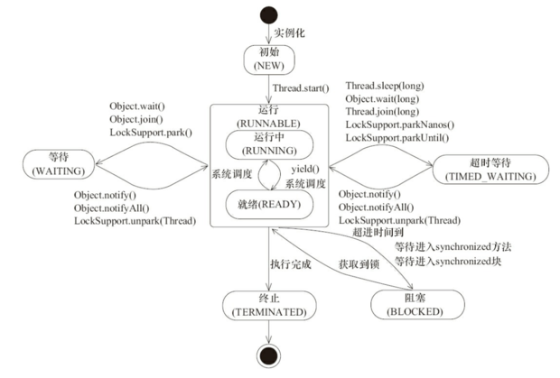
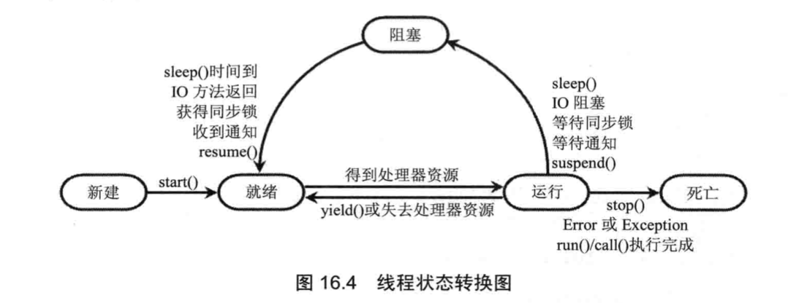
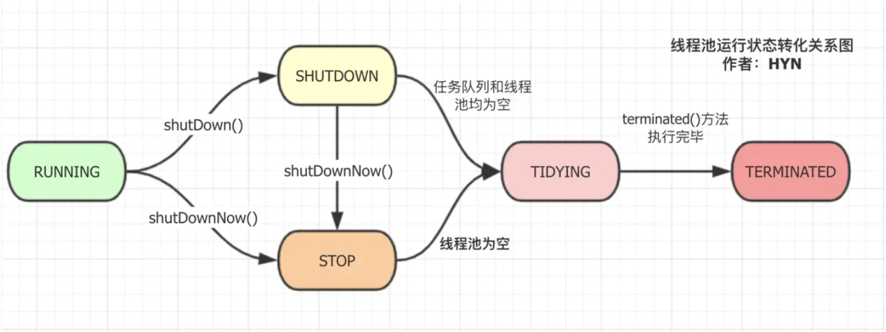
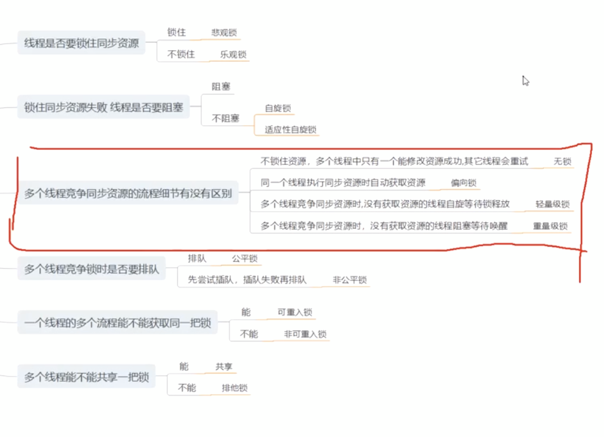
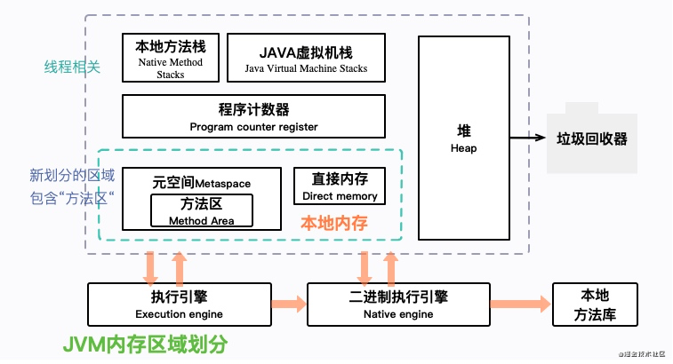

# Java 多线程

## AbstractQueuedSynchronizer详解

[Java AQS源码解读|掘金](https://juejin.cn/post/6844904035862986765)

------

##### 线程安全问题的本质：

> 数据的安全性

多个线程访问共同的资源时，在某一个线程对资源进行写操作的中途，其它线程对该资源进行读、写，导致出现了数据的错误。

##### 锁机制的本质：

> 对资源进行访问限制

在多线程访问的情况下保证数据的准确性。

**独占锁：**

实现方法：

- ReentrantLock

- ReentrantReadWriteLock.WriteLock

实现策略：

- tryAcquire(int)

- tryRelease(int)

- isHeldExclusively()

**共享锁：**

实现方法：

- CountDownLatch
- ReentrantReadWriteLock.ReadLock

- Semaphore

实现策略：

- tryAcquireShared(int)
- tryReleaseShared(int)

------

我们可以猜测出，AQS其实主要做了这么几件事情：

- 同步状态（state）的维护管理
- 等待队列的维护管理
- 线程的阻塞与唤醒

------

源码解读

```java
/**
 * 获取独占锁，忽略中断。
 * 首先尝试获取锁，如果成功，则返回true；否则会把当前线程包装成Node插入到队尾，在队列中会检测是否为head的直接后继，并尝试获取锁,
 * 如果获取失败，则会通过LockSupport阻塞当前线程，直至被释放锁的线程唤醒或者被中断，随后再次尝试获取锁，如此反复。被唤醒后继续之前的代码执行
 */
public final void acquire(int arg) {
	//tryAcquire(arg)：尝试获取锁，当成功时直接返回。失败则继续执行接下来的方法
	//addWaiter(Node.EXCLUSIVE)：添加由当前线程构造的独占模式的节点到CLH同步队列中
	//acuqireQueued(node,arg)：再挣扎一下。尝试自选获取锁，获取不到则老实进入CLH等待队列并堵塞
  if (!tryAcquire(arg) && acquireQueued(addWaiter(Node.EXCLUSIVE), arg)){
    selfInterrupt();
  }
}
```

------

**共享锁**

与获取独占锁不同，关键在于，共享锁可以被多个线程持有。

如果需要使用AQS实现共享锁，在实现tryAcquireShared()方法时：

- 返回负数，表示获取失败

- 返回0，表示获取成功，但是后继争用线程不会成功

- 返回正数，表示获取成功，表示后继争用线程也可能成功

源码解读：

```java
    /**
     * 获取共享模式的锁。
     * 先调用一次tryAcquireShared方法尝试获取锁，如果获取锁成功则返回。如果不成功则
     * 循序尝试再次获取锁，或者被阻塞。
     */
    public final void acquireShared(int arg) {
      	// 先调用一次tryAcquireShared方法尝试获取锁，如果获取锁成功则返回。
        if (tryAcquireShared(arg) < 0)
          	// 循序尝试再次获取锁，或者被阻塞。
            doAcquireShared(arg);
    }
```

------

**思考1：如何快速理解程序（或者某个对象）中的复杂逻辑？**

> 想要搞清楚程序（或者某个对象）中复杂的逻辑，首先要搞清楚程序（或者某个对象）所依赖的数据结构。因为程序=数据结构+算法。搞清楚数据结构，对我们理解程序（或者某个对象）的复杂逻辑大有裨益。

------

**线程**

[线程|掘金](https://juejin.cn/post/6844904166565871630)

线程的实现方式：

- 使用内核线程实现（1:1）
- 使用线程实现（1:N）
  - 近几年，以并发闻名于耳的编程语言Go、Erlang则使用的是用户线程。现在我们知道Go、ErLang语言天生支持高并发的本质原因了。
- 混合实现（N:M）

线程的调度方式：

- 协同式线程调度
- 抢占式线程调度（java线程的实现方式）

源码分析：

```java
//根据系统计时器和调度程序的精度和准确性，使当前正在执行的线程进入休眠状态（暂时停止执行）达指定的毫秒数。 该线程不会失去任何监视器的所有权。
//其他线程可以中断此线程（使用InterruptedException异常或者修改interrupt状态）。
//调用此方法时调用线程的状态为：TIMED_WAITING
//public static native void sleep(long millis) throws InterruptedException;
//public static void sleep(long millis, int nanos) throws InterruptedException {
java.lang.Thread#sleep(long)
java.lang.Thread#sleep(long, int)

  //最多用m毫秒等待该线程终止。超时为0表示永远等待。
	//此方法使用当this.isAlive时循环调用this.wait的方式实现。当线程终止时，将调用this.notifyAll方法。建议应用程序不要在Thread实例上使用Object对象上的wait，notify或notifyAll方法。
  //线程A调用了对象B的此方法时。线程A的状态为：WAITING
	//public final synchronized void join(long millis) throws InterruptedException {
	java.lang.Thread#join(long)
  java.lang.Thread#join(long, int)
  java.lang.Thread#join()
  
  //这个方法是不安全的，很可能会产生不可预料的结果，就好比通过断电源关机，而不是通过正常关机操作来完成，结果相同，过程却完全不同
  //调用 stop() 将会抛出一个ThreadDeath异常，这时候run方法也就执行结束了，线程就终止了，这种是用抛异常来结束线程的
  //结束后会释放子线程所持有的所有锁，一般任何进行加锁的代码块，都是为了保护数据的一致性，如果在调用thread.stop()后导致了该线程所持有的所有锁的突然释放(不可控制)，那么被保护数据就有可能呈现不一致性，其他线程在使用这些被破坏的数据时，有可能导致一些很奇怪的应用程序错误
  java.lang.Thread#stop()
  
  //stop() 方法也可中断线程，但它是立即终止，会引发一些未知的问题，所以就出现了 interrupt() 方法，用它可实现有条件的终止线程，使得数据安全得到保障
  //要想真正实现线程中断， interrupt() 需要配合 isInterrupted() 或 interrupted() 一起使用，这两个方法可以获取中断标记是否为 true，获取后我们就可以做合理的处理。
  //调用 isInterrupted() 会返回中断状态但不会还原状态， interrupted() 会返回中断状态并清除中断状态，根据实际业务需求分别使用即可
  java.lang.Thread#interrupt()
```


------

注意：java中的线程状态只有6种。

```java
    public enum State {

        NEW, // 尚未启动状态

        RUNNABLE, // 可运行状态，但它可能还在等待处理器资源分配

        BLOCKED, // 阻塞状态

        WAITING, // 等待状态，等待另一个线程执行完毕

        TIMED_WAITING, // 定时等待状态

        TERMINATED; // 终止状态，线程已执行完毕
    }


```


操作系统中Runnable会被分为Runnable和Running。状态流转如下图：








------

### Thread 使用中常见问题

##### 死锁产生的原因以及如何避免和解决

**为什么产生死锁？**

产生死锁必须同时满足以下四个条件，只要其中任一条件不成立，死锁就不会发生

- 互斥条件：线程要求对所分配的资源进行排他性控制,即在一段时间内某 资源仅为一个进程所占有.此时若有其他进程请求该资源.则请求进程只能等待.
- 不剥夺条件：进程所获得的资源在未使用完毕之前,不能被其他进程强行夺走,即只能由获得该资源的线程自己来释放（只能是主动释放).
- 请求和保持条件：线程已经保持了至少一个资源,但又提出了新的资源请求,而该资源已被其他线程占有,此时请求线程被阻塞,但对自己已获得的资源保持不放.
- 循环等待条件：存在一种线程资源的循环等待链,链中每一个线程已获得的资源同时被链中下一个线程所请求。

死锁产生条件总结：

1. 有至少一个资源不能共享
2. 至少有一个任务必须持有一个资源并且等待获取另一个被别的任务持有的资源
3. 资源不能任务抢占
4. 必须有循环等待

**如何避免和解决死锁？**

1、**避免嵌套锁**  这是死锁最常见的原因，如果您已经持有一个资源，请避免锁定另一个资源。如果只使用一个对象锁，则几乎不可能出现死锁情况。

2、**只锁需要的部分** 只获对需要的资源加锁，如果我们只需要其中一个字段，那么我们应该只锁定那个特定的字段而不是完整的对象。

3、**避免无限期等待** 如果两个线程使用 thread join 无限期互相等待也会造成死锁，我们可以设定等待的最大时间来避免这种情况。

------

#### JAVA 中锁的种类与区别

在代码执行过程中，一些数据需要进行排他性的控制以保证最终计算结果的正确性，所以需要有一种机制保证在执行过程中此数据被锁住不会被外界修改，这种机制就是锁机制。

同时，根据锁的特性、设计、状态不同，又可以不严格的分为以下几类：

**公平锁/非公平锁**:按照获取锁资源的顺序。

公平锁指多个线程按照申请锁的顺序来获取锁，非公平锁就是没有顺序完全随机，可能会造成优先级反转或饥饿显现

Synchronized 是非公平锁，ReentrantLock 通过构造函数可以决定是公平锁还是非公平锁，模式是非公平锁

非公平锁的吞吐量性能比公平锁要更大

**可重入锁**

也叫递归锁，指同一线程在外层方法获取锁的时候，进入内层方法会自动获取锁

Synchronized 和 ReentranLock 都是可重入锁，可在一定程度上避免死锁

**独享锁/共享锁**：是否可以被一个线程多次持有。

独享锁是指该锁一次只能被一个线程持有，共享锁是指该锁可以被多个线程持有

Synchronized 和 ReentranLock 都是独享锁。ReadWriteLock 的读锁是共享锁，写锁是独占锁。ReentrantLock 的独享锁和共享锁也是通过 AQS 来实现的

**互斥锁/读写锁**

互斥锁 = 独享锁，读写锁 = 共享锁。互斥锁实质就是 ReentrantLock，读写锁实质就是 ReadWriteLock

**乐观锁/悲观锁**：看待数据并发的角度。

它们不属于具体的锁分类，而是看待并发同步的角度

乐观锁认为对于同一数据的并发操作是不会发生修改的，在更新数据的时候回采用不断的尝试更新，乐观锁认为不加锁的并发操作是没事的

悲观锁认为对于同一个数据的并发操作一定是会发生修改的，因此对于统一数据的并发操作，悲观锁采取加锁形式，因为悲观锁认为不加锁的操作一定会有问题

悲观锁适合操作非常多的场景，乐观锁适合读写非常多的场景，不加锁可以大大提高性能

**分段锁**：是一种锁的策略。

其实是一种锁的策略，不是具体锁。如 ConcurrentHashMap 并发的实现就是通过分段锁的形式来实现高效并发操作

当要 put 元素时并不是对整个 hashMap 加锁，而是先通过 hashCode 知道它要放在哪个分段，然后对分段进行加锁，所以多线程 put 元素时只要放在不同分段就是做到真正的并行插入，但是统计 size 时就需要获取所有的分段锁才能计算

分段锁的设计是为了细化锁的粒度

**偏向锁/轻量级锁/重量级锁**：按照锁的状态。

这是按照锁状态来归纳的，并且是针对 Synchronized 的。java 1.6 为了减少获取锁是释放锁带来的性能问题引入了一种状态，它会随着竞争情况逐渐升级，锁可以升级但不可降级，意味着偏向锁升级成轻量级锁后无法回撤，这种升级无法降级的策略目的就是为了提高活的锁和释放锁的效率

**自旋锁**：锁实现的一种方式，和阻塞的方式相对应。

其实是相对于互斥锁的概念，互斥锁线程会进入 WAITING 状态和 RUNNABLE 状态的切换，涉及上下文切换、CPU抢占等开销，自旋锁的线程一直是 RUNNABLE 状态，一直在那循环检测锁标志位，机制不重复，但是自旋锁加锁全程消耗 CPU，起始开销虽然低于互斥锁，但随着持锁时间加锁开销是线性增长

**可中断锁**：是否可中断。

Synchronized 是不可中断的，Lock 是可中断的

这里的可中断建立在阻塞等待中断，运行中是无法中断的




------

## JVM

[38个JVM精选问答，让你变成专家！|掘金](https://juejin.cn/post/6936390496122044423)

**JVM内存结构**

- **堆**：JVM堆中的数据，是共享的，是占用内存最大的一块区域
- **虚拟机栈**：Java虚拟机栈，是基于线程的，用来服务字节码指令的运行
- **程序计数器**：当前线程所执行的字节码的行号指示器
- **元空间**：方法区就在这里，非堆
- 本地内存：其他的内存占用空间

