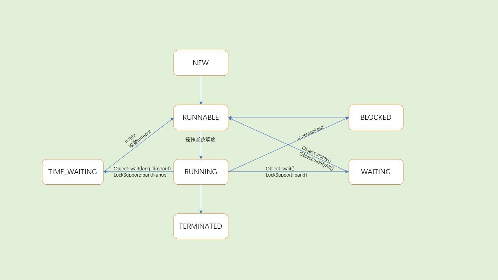

# Java 多线程

## AbstractQueuedSynchronizer详解

[Java AQS源码解读|掘金](https://juejin.cn/post/6844904035862986765)

------

**独占锁：**

实现方法：

- ReentrantLock

- ReentrantReadWriteLock.WriteLock

实现策略：

- tryAcquire(int)

- tryRelease(int)

- isHeldExclusively()

**共享锁：**

实现方法：

- CountDownLatch
- ReentrantReadWriteLock.ReadLock

- Semaphore

实现策略：

- tryAcquireShared(int)
- tryReleaseShared(int)

------

我们可以猜测出，AQS其实主要做了这么几件事情：

- 同步状态（state）的维护管理
- 等待队列的维护管理
- 线程的阻塞与唤醒

------

源码解读

```java
/**
 * 获取独占锁，忽略中断。
 * 首先尝试获取锁，如果成功，则返回true；否则会把当前线程包装成Node插入到队尾，在队列中会检测是否为head的直接后继，并尝试获取锁,
 * 如果获取失败，则会通过LockSupport阻塞当前线程，直至被释放锁的线程唤醒或者被中断，随后再次尝试获取锁，如此反复。被唤醒后继续之前的代码执行
 */
public final void acquire(int arg) {
	//tryAcquire(arg)：尝试获取锁，当成功时直接返回。失败则继续执行接下来的方法
	//addWaiter(Node.EXCLUSIVE)：添加由当前线程构造的独占模式的节点到CLH同步队列中
	//acuqireQueued(node,arg)：再挣扎一下。尝试自选获取锁，获取不到则老实进入CLH等待队列并堵塞
  if (!tryAcquire(arg) && acquireQueued(addWaiter(Node.EXCLUSIVE), arg)){
    selfInterrupt();
  }
}
```

------

**共享锁**

与获取独占锁不同，关键在于，共享锁可以被多个线程持有。

如果需要使用AQS实现共享锁，在实现tryAcquireShared()方法时：

- 返回负数，表示获取失败

- 返回0，表示获取成功，但是后继争用线程不会成功

- 返回正数，表示获取成功，表示后继争用线程也可能成功

源码解读：

```java
    /**
     * 获取共享模式的锁。
     * 先调用一次tryAcquireShared方法尝试获取锁，如果获取锁成功则返回。如果不成功则
     * 循序尝试再次获取锁，或者被阻塞。
     */
    public final void acquireShared(int arg) {
      	// 先调用一次tryAcquireShared方法尝试获取锁，如果获取锁成功则返回。
        if (tryAcquireShared(arg) < 0)
          	// 循序尝试再次获取锁，或者被阻塞。
            doAcquireShared(arg);
    }
```

------

**思考1：如何快速理解程序（或者某个对象）中的复杂逻辑？**

> 想要搞清楚程序（或者某个对象）中复杂的逻辑，首先要搞清楚程序（或者某个对象）所依赖的数据结构。因为程序=数据结构+算法。搞清楚数据结构，对我们理解程序（或者某个对象）的复杂逻辑大有裨益。

------

**线程**

[线程|掘金](https://juejin.cn/post/6844904166565871630)

线程的实现方式：

- 使用内核线程实现（1:1）
- 使用线程实现（1:N）
  - 近几年，以并发闻名于耳的编程语言Go、Erlang则使用的是用户线程。现在我们知道Go、ErLang语言天生支持高并发的本质原因了。
- 混合实现（N:M）

线程的调度方式：

- 协同式线程调度
- 抢占式线程调度（java线程的实现方式）



